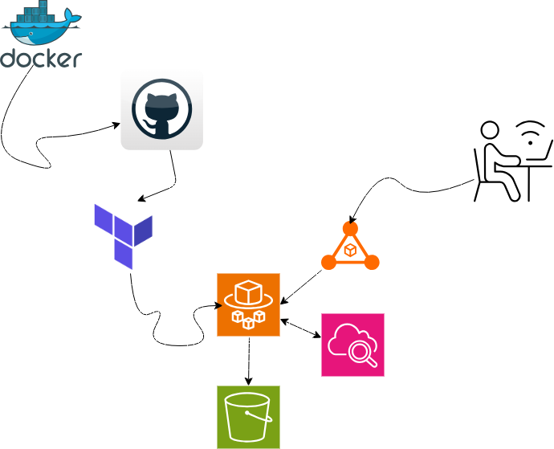
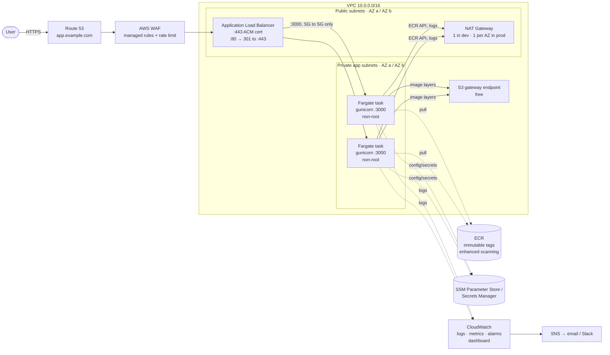
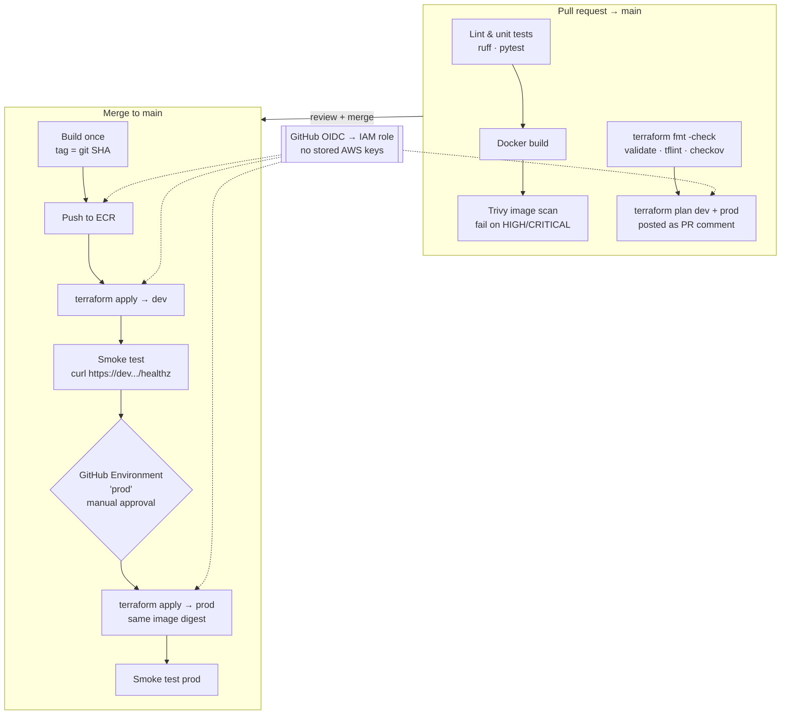

# Simple Terraform App — Flask Calculator on AWS ECS Fargate

A small Flask calculator, containerised with Docker, deployed to AWS ECS Fargate behind an Application Load Balancer, provisioned with Terraform and shipped by GitHub Actions.

The app is deliberately trivial. The point of the project is the platform around it: networking, IAM, CI/CD, scaling, observability and infrastructure-as-code.

- [Current architecture](#current-architecture)
- [Target system design](#target-system-design)
- [Repository layout (target)](#repository-layout-target)
- [Roadmap](#roadmap)
- [Known issues in the current code](#known-issues-in-the-current-code)
- [Running locally](#running-locally)

---

## Current architecture



What exists today:

| Layer | Implementation |
|---|---|
| App | Flask + gunicorn on port 3000 (`calculate.py`) |
| Image | Multi-stage `Dockerfile` on `python:3.12-slim` |
| Registry | ECR repo `cb-app-<workspace>` (immutable tags, scan on push) |
| Compute | ECS Fargate service in private subnets, 2 AZs |
| Ingress | Public ALB, HTTP :80 only |
| Egress | One NAT gateway per AZ |
| Scaling | Step scaling on CPU (85% up / 10% down), 3–6 tasks |
| Alerts | CloudWatch CPU alarms → SNS email |
| State | S3 bucket + DynamoDB lock table (`terraform-fargate/backend-setup`) |
| CI/CD | One GitHub Actions job: build → Trivy → push to ECR → `terraform apply -auto-approve` (prod only) |

---

## Target system design

### Goals

1. **Secure by default**: HTTPS everywhere, no long-lived AWS keys, least-privilege IAM, a non-root container.
2. **Safe changes**: every change is planned and reviewed before it is applied, and prod needs a manual approval.
3. **Reproducible environments**: dev and prod come from the same modules with different inputs and separate state.
4. **Self-healing**: failed deployments roll back automatically, and scaling tracks real load.
5. **Observable**: alerts fire on user-facing symptoms (5xx errors, latency, unhealthy targets), not only on CPU.
6. **Cost-aware**: dev is cheap; prod pays for high availability.

### Runtime architecture



**Key decisions**

| Area | Decision | Why |
|---|---|---|
| Ingress | ALB with an ACM certificate on :443; :80 only redirects | The current setup sends traffic in plain text |
| Edge protection | WAF with AWS managed rule groups and a per-IP rate limit (prod) | Cheap protection against common attacks and floods |
| Network | Public subnets hold only the ALB and NAT; tasks sit in private subnets with no public IP. The public subnets get **their own** route table, not the VPC main one | Today, any new subnet is public by default because the IGW route is on the main table |
| Egress | Dev: **one** NAT gateway. Prod: one per AZ. Both get a free S3 gateway endpoint (ECR image layers come from S3) | A NAT gateway costs about $33/month plus data. HA only matters in prod |
| Security groups | ALB SG: 443/80 from the internet. Task SG: `app_port` from the ALB SG only | Tasks can never be reached directly |
| Compute | Fargate with the **deployment circuit breaker + rollback** enabled, `health_check_grace_period_seconds` set, and `ignore_changes = [desired_count]` | Bad deploys roll back on their own; Terraform stops fighting the autoscaler |
| Scaling | **Target tracking** (CPU around 60% and ALB requests per target), min/max set per environment | Simpler and more correct than hand-written step policies |
| Container | Runs as a non-root user; read-only root filesystem; pinned dependencies; `.dockerignore` | Smaller attack surface and reproducible builds |
| IAM | Task *execution* role (pull images, write logs) kept separate from the task role (app permissions, empty for now) | Least privilege |
| Config/secrets | SSM Parameter Store / Secrets Manager, injected through `secrets` in the task definition | Nothing sensitive in tfvars or in the image |
| Observability | Log group per environment (`/ecs/cb-app-<env>`), 30-day retention. Alarms on ALB 5xx, target response time p95, `UnHealthyHostCount` and running tasks < desired. One CloudWatch dashboard | Alert on what users feel |

### CI/CD design



**Rules**

- **No AWS access keys in GitHub.** Use `aws-actions/configure-aws-credentials` with `role-to-assume`. The IAM trust policy is limited to `repo:TobyMidas/Simple_Terraform_App:*`, and the prod role is limited to the `prod` environment.
- **Plan on the PR, apply on merge.** Never run `apply -auto-approve` on something nobody has reviewed.
- **Build once, promote the same image.** Prod runs exactly the digest that passed in dev.
- **Pin third-party actions** to a release tag or commit SHA (never `@master`).
- **Path filters**: README-only changes should not trigger a deployment.

### Terraform design

- **Two root stacks per environment**, to fix the "push to ECR before ECR exists" chicken-and-egg problem:
  1. `bootstrap/`: state bucket, GitHub OIDC provider, CI IAM roles, ECR repository. Applied once, by hand.
  2. `envs/<env>/`: network, ALB, ECS, alarms. Applied by CI.
- **Modules** for `network`, `alb`, `ecs-service` and `observability`. The environments differ only in their `terraform.tfvars`.
- **Separate state per environment** (`envs/dev/terraform.tfstate`, `envs/prod/terraform.tfstate`) instead of workspaces, so a wrong `workspace select` can't touch prod.
- **Pin versions**: `required_version >= 1.10` and `aws ~> 6.0`, with the lock file committed for **both** linux_amd64 and darwin_arm64 (`terraform providers lock -platform=...`).
- **Use native S3 locking** (`use_lockfile = true`, Terraform 1.10+). The DynamoDB lock table is no longer needed.
- **Replace `data "template_file"`** with the built-in `templatefile()`. The `template` provider is archived and has no Apple Silicon build.
- **Tag everything** with `default_tags` in the provider block (`Project`, `Environment`, `ManagedBy = terraform`).

### Environment sizing

| | dev | prod |
|---|---|---|
| AZs | 2 | 2 (3 optional) |
| NAT gateways | 1 | 1 per AZ |
| Tasks (min / max) | 1 / 2 | 2 / 6 |
| Task size | 0.25 vCPU / 512 MiB | 0.5 vCPU / 1 GiB |
| WAF | off | on |
| ALB deletion protection | off | on |
| Approx. monthly cost (us-east-1)* | about $55–65 | about $120–150 |

\* A rough estimate: ALB, NAT gateway hours and Fargate running 24/7. It excludes data transfer. Check with the AWS Pricing Calculator. **Run `terraform destroy` on dev when you're not using it.**

---

## Repository layout (target)

```
.
├── app/
│   ├── calculate.py
│   ├── templates/index.html
│   ├── requirements.txt        # pinned versions
│   └── tests/test_calculate.py
├── Dockerfile
├── .dockerignore
├── infra/
│   ├── bootstrap/              # state bucket, OIDC, CI roles, ECR (manual, once)
│   ├── modules/
│   │   ├── network/
│   │   ├── alb/
│   │   ├── ecs-service/
│   │   └── observability/
│   └── envs/
│       ├── dev/                # main.tf, backend.tf, terraform.tfvars
│       └── prod/
├── .github/workflows/
│   ├── pr.yml                  # test, scan, plan
│   └── deploy.yml              # build, push, apply dev → approve → prod
├── docs/
│   └── architecture.png
└── README.md
```

---

## Roadmap

Work through these in order. Each phase leaves the project in a working state.

**Phase 1: Make it work reliably**
- [ ] Replace `template_file` with `templatefile()`; add `required_providers` / `required_version`; regenerate the lock file for all platforms
- [ ] Fix the scale-down policy (`metric_interval_upper_bound = 0`), or switch to target tracking
- [ ] Add `lifecycle { ignore_changes = [desired_count] }` to the ECS service; take min/max capacity from variables
- [ ] Add the environment to the log group and alarm names; pass the log group name into the task template
- [ ] Remove the duplicate ALB ingress rule and the unused log stream
- [ ] Give the public subnets their own route table
- [ ] Run `terraform fmt -recursive`; add types to all variables
- [ ] Add a root `.gitignore`; remove `.DS_Store`

**Phase 2: Secure it**
- [ ] GitHub OIDC provider and IAM role; delete the `AWS_ACCESS_KEY_ID` / `AWS_SECRET_ACCESS_KEY` secrets
- [ ] ACM certificate, HTTPS listener, HTTP→HTTPS redirect (needs a domain in Route 53)
- [ ] Non-root user in the Dockerfile, a `.dockerignore`, pinned `requirements.txt`
- [ ] Pin GitHub Actions versions (`checkout@v4`, `setup-terraform@v3`, pin `trivy-action` to a release)

**Phase 3: Safe delivery**
- [ ] Split the workflow into `pr.yml` (test, scan, plan) and `deploy.yml` (apply)
- [ ] pytest tests for `calculate.py` (every operation, divide by zero, bad input)
- [ ] `tflint` + `checkov` in CI
- [ ] Deploy dev automatically; prod behind a GitHub Environment with required reviewers
- [ ] Move ECR into `bootstrap/` so CI can push before the environment stacks exist
- [ ] ECS deployment circuit breaker with rollback

**Phase 4: Operate it**
- [ ] A `/healthz` endpoint; point the ALB and container health checks at it
- [ ] Alarms on 5xx, p95 latency and unhealthy hosts; drop the noisy "CPU low" email
- [ ] CloudWatch dashboard
- [ ] WAF on the prod ALB

**Phase 5: Refactor**
- [ ] Split Terraform into modules and `envs/dev`, `envs/prod` with separate state
- [ ] `default_tags`; AWS Budgets alert
- [ ] Update `docs/architecture.png` to match this design

---

## Known issues in the current code

Found in a review of the `main` branch:

| # | File | Issue |
|---|---|---|
| 1 | `terraform-fargate/ecs.tf:7` | `data "template_file"` needs the archived `hashicorp/template` provider, so `terraform init` fails on Apple Silicon |
| 2 | `terraform-fargate/provider.tf` | No `required_providers`. The lock file pins AWS 6.x while `backend-setup` requires `~> 5.0` |
| 3 | `.github/workflows/tests.yml` | Pushes to ECR `cb-app-prod` before Terraform creates it, so the first run fails |
| 4 | `terraform-fargate/auto_scaling.tf:44` | Scale-down uses `lower_bound = 0` on a "less than" alarm, so it never scales in |
| 5 | `terraform-fargate/auto_scaling.tf:8` | `min_capacity = 3` is hard-coded and overrides dev's `app_count = 1` |
| 6 | `terraform-fargate/ecs.tf` | No `ignore_changes = [desired_count]`, so each apply resets the autoscaler |
| 7 | `logs.tf`, `auto_scaling.tf` | Log group and alarm names lack the workspace, so dev and prod clash in one account |
| 8 | `.github/workflows/tests.yml` | Long-lived AWS keys; `apply -auto-approve` with no plan review; `trivy-action@master` unpinned |
| 9 | `terraform-fargate/alb.tf` | HTTP only, no TLS |
| 10 | `terraform-fargate/security.tf:9-21` | Duplicate ingress rule |
| 11 | `terraform-fargate/network.tf:34` | IGW route on the VPC main route table |
| 12 | `Dockerfile` | Runs as root; no `.dockerignore` (copies `.git`, Terraform files and more into the image) |
| 13 | `Requirements.txt` | No pinned versions |
| 14 | `auto_scaling.tf:85` | The "CPU low" alarm emails SNS whenever the app is idle |
| 15 | repo | No tests despite the workflow being named `tests.yml`; `.DS_Store` committed; `terraform fmt` fails on 8 files |

---

## Running locally

```bash
# Python
pip install -r Requirements.txt
python calculate.py            # http://localhost:3000

# Docker
docker build -t basiccalculator .
docker run --rm -p 3000:3000 basiccalculator
```

### Deploying (current setup)

```bash
# 1. One-time: create the remote state bucket + lock table
cd terraform-fargate/backend-setup
terraform init && terraform apply

# 2. Create the ECR repo first (works around issue #3), then push an image to it
cd ..
terraform init
terraform workspace select prod || terraform workspace new prod
terraform apply -var-file=prod.tfvars -target=aws_ecr_repository.app -var="app_image=placeholder"

# 3. Deploy everything
terraform apply -var-file=prod.tfvars -var="app_image=<account>.dkr.ecr.us-east-1.amazonaws.com/cb-app-prod:<tag>"
```

The app URL is printed as the `app_url` output. Confirm the SNS subscription email to receive alerts.
